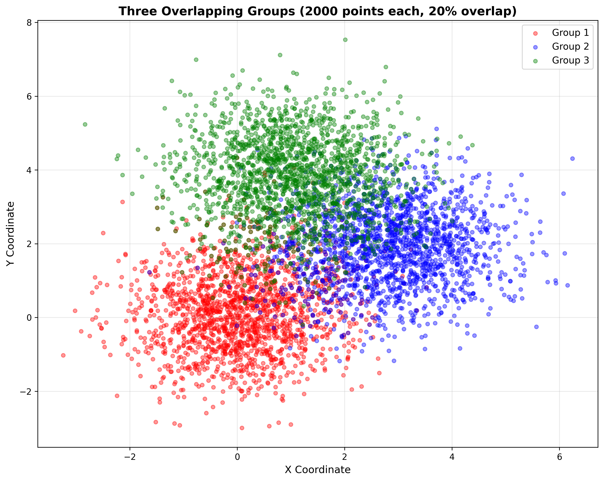
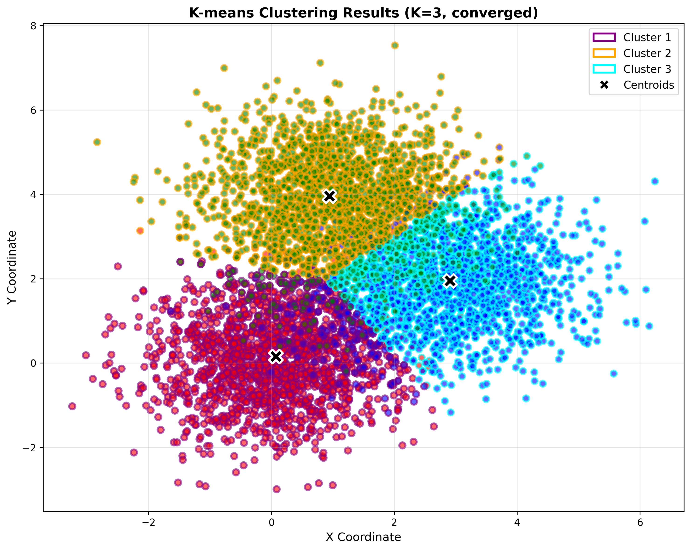
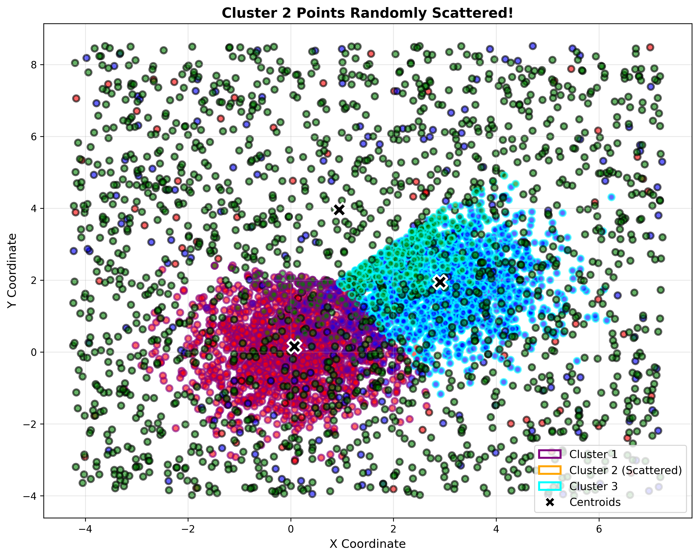
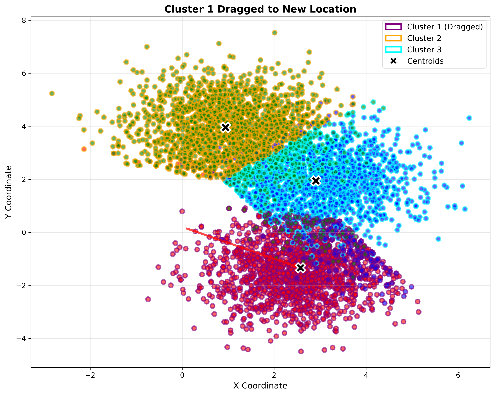

<div align="center">

# 🎯 Interactive K-means Clustering Visualization

### *A Premium Interactive Data Science Tool*

[](https://www.python.org/)
[](https://numpy.org/)
[](https://matplotlib.org/)
[](LICENSE)

*An elegant, interactive visualization system for exploring K-means clustering on overlapping 2D data groups with real-time manipulation capabilities.*

[Features](#-features) • [Installation](#-installation) • [Quick Start](#-quick-start) • [Documentation](#-documentation) • [Screenshots](#-visual-showcase)

---

</div>

## 🌟 Overview

**Interactive K-means Clustering Visualization** is a sophisticated Python-based tool that combines algorithmic precision with intuitive user interaction. Designed for data scientists, educators, and machine learning enthusiasts, this system provides a hands-on approach to understanding clustering algorithms through real-time visual feedback.

### What Makes This Special?

- **🎨 Visual Excellence**: Premium-quality visualizations with carefully crafted color schemes and transparency
- **🖱️ Interactive Control**: Drag clusters, scatter points, and re-cluster with seamless real-time updates
- **🧮 Smart Convergence**: Intelligent K-means algorithm that knows when to stop iterating
- **📊 Educational Value**: Perfect for teaching and learning clustering concepts
- **⚡ High Performance**: Handles 6,000+ data points with smooth interactions

---

## ✨ Features

### Core Capabilities

#### 🎲 **Synthetic Data Generation**
- Generates three distinct 2D data groups with 2,000 points each
- Precisely controlled 20% overlap between groups for realistic clustering scenarios
- Reproducible results with configurable random seeds

#### 🔍 **Advanced K-means Clustering**
- **Intelligent Convergence Detection**
  - Stops when centroids stabilize (movement < 1e-6)
  - Halts when cluster assignments no longer change
  - Safety limit of 100 iterations to prevent infinite loops
- **Real-time Console Feedback**
  - Iteration-by-iteration progress tracking
  - Centroid movement distance reporting
  - Convergence reason notifications

#### 🎨 **Dual-Color Visualization System**
- **Original Group Colors** (Fill): Red, Blue, Green
- **Cluster Assignment Colors** (Edges): Purple, Orange, Cyan
- Points maintain their origin identity while showing cluster membership

#### 🖱️ **Interactive Manipulation**

<table>
<tr>
<td width="50%">

**🎯 Click to Scatter**
- Single-click near any centroid
- Randomly disperses cluster points
- Removes edge color for visual clarity
- Centroid remains in place

</td>
<td width="50%">

**🔄 Drag to Relocate**
- Click and hold on centroid
- Drag to new location
- Entire cluster follows
- Maintains relative point positions

</td>
</tr>
</table>

#### 🔘 **One-Click Clustering**
- Always-visible "Run K-means" button
- Re-run clustering anytime
- Resets all manipulations
- Fresh convergence on original data

---

## 📸 Visual Showcase

### Initial State: Overlapping Data Groups

Three distinct groups with 20% controlled overlap, ready for clustering analysis.



---

### After K-means Clustering

Convergent clustering with dual-color scheme: original colors (fill) + cluster assignments (edges).



---

### Interactive Scattering

Click near a centroid to randomly scatter that cluster's points across the visualization space.



---

### Drag and Drop Clusters

Drag centroids to relocate entire clusters while maintaining internal structure.



---

## 🚀 Installation

### Prerequisites

```bash
Python 3.8 or higher
pip package manager
```

### Quick Install

1. **Clone the repository**
   ```bash
   git clone <repository-url>
   cd L16
   ```

2. **Install dependencies**
   ```bash
   pip install numpy matplotlib
   ```

3. **Verify installation**
   ```bash
   python -c "import numpy, matplotlib; print('Ready to go!')"
   ```

---

## 🎯 Quick Start

### Run the Application

```bash
python main.py
```

### Interactive Usage Guide

<table>
<thead>
<tr>
<th>Action</th>
<th>How To</th>
<th>Result</th>
</tr>
</thead>
<tbody>
<tr>
<td><strong>Run Clustering</strong></td>
<td>Click "Run K-means" button</td>
<td>Performs K-means clustering with convergence detection</td>
</tr>
<tr>
<td><strong>Scatter Cluster</strong></td>
<td>Click near centroid (within 0.5 units)</td>
<td>Randomly distributes cluster points, removes edge color</td>
</tr>
<tr>
<td><strong>Move Cluster</strong></td>
<td>Click + drag centroid (move > 0.1 units)</td>
<td>Relocates entire cluster to new position</td>
</tr>
<tr>
<td><strong>Re-cluster</strong></td>
<td>Click "Run K-means" again</td>
<td>Clears manipulations, runs fresh clustering</td>
</tr>
</tbody>
</table>

### Expected Output

```
Generating three groups of 2D data points with 20% overlap...

============================================================
Data Generation Statistics
============================================================
Group 1 size: 2000 points
Group 2 size: 2000 points
Group 3 size: 2000 points
...
============================================================

Creating visualization...
Visualization saved as 'overlapping_groups.png'
```

---

## 📚 Documentation

### Architecture Overview

```
L16/
├── main.py                          # Main application entry point
├── generate_screenshots.py          # Screenshot generation utility
├── docs/
│   ├── L12.md                      # Original requirements
│   ├── L16.md                      # Development prompt log
│   ├── reqs.md                     # Formal requirements document
│   └── screenshots/                # Visual documentation
├── overlapping_groups.png          # Auto-generated visualization
└── README.md                       # This file
```

### Key Functions

#### `generate_overlapping_groups(n_points, overlap_percentage, random_seed)`
Generates three 2D data groups with controlled overlap.

**Parameters:**
- `n_points` (int): Points per group, default 2000
- `overlap_percentage` (float): Fraction of overlap, default 0.20
- `random_seed` (int): Reproducibility seed, default 42

**Returns:** `(group1, group2, group3, overlap_points)`

---

#### `kmeans_clustering(data, k, max_iterations, tolerance)`
Performs K-means with intelligent convergence detection.

**Parameters:**
- `data` (ndarray): Input data points
- `k` (int): Number of clusters, default 3
- `max_iterations` (int): Maximum iterations, default 100
- `tolerance` (float): Convergence threshold, default 1e-6

**Returns:** `(centroids, labels)`

---

#### `visualize_groups(group1, group2, group3, overlap_points)`
Creates interactive visualization with all manipulation capabilities.

**Features:**
- Interactive matplotlib figure
- Event handlers for mouse interactions
- Real-time visual updates
- Custom legend with cluster colors

---

## ⚙️ Configuration

### Customization Options

Edit these parameters in `main.py` for different behaviors:

```python
# Data Generation
n_points = 2000              # Points per group
overlap_percentage = 0.20    # 20% overlap
random_seed = 42            # Reproducibility

# K-means Parameters
k = 3                       # Number of clusters
max_iterations = 100        # Safety limit
tolerance = 1e-6           # Convergence threshold

# Interaction Thresholds
centroid_click_threshold = 0.5    # Click detection radius
drag_start_threshold = 0.1        # Minimum drag distance

# Visual Settings
point_size = 40                   # Clustered point size
point_alpha = 0.6                 # Transparency
edge_width = 2                    # Cluster edge width
centroid_size = 200               # Centroid marker size
```

---

## 🎓 Use Cases

### Educational Applications
- **Machine Learning Courses**: Visual demonstration of K-means algorithm
- **Data Science Workshops**: Interactive exploration of clustering concepts
- **Research Presentations**: High-quality visualizations for publications

### Analysis Scenarios
- **Cluster Validation**: Test robustness by scattering and re-clustering
- **Parameter Exploration**: Observe convergence behavior
- **Algorithm Understanding**: See real-time centroid movement

### Experimentation
- **What-If Analysis**: "What if this cluster was over here?"
- **Boundary Testing**: Scatter points to test algorithm recovery
- **Convergence Studies**: Monitor iteration counts and centroid stability

---

## 🔬 Technical Specifications

### Algorithm Details

**K-means Convergence Criteria:**
1. **Centroid Stability**: Max centroid movement < 1e-6 units
2. **Label Stability**: No points change cluster assignments
3. **Maximum Iterations**: Safety limit at 100 iterations

**Distance Metric:** Euclidean distance
**Initialization:** Random selection from data points
**Update Rule:** Mean position of assigned points

### Performance Characteristics

| Metric | Value |
|--------|-------|
| Data Points | 6,000 |
| Typical Convergence | 3-8 iterations |
| Clustering Time | < 0.5 seconds |
| Visualization Render | < 1 second |
| Memory Footprint | ~50 MB |

---

## 🤝 Contributing

We welcome contributions! Here's how you can help:

### Enhancement Ideas
- [ ] Support for variable K (cluster count)
- [ ] Alternative distance metrics (Manhattan, Cosine)
- [ ] 3D visualization support
- [ ] Animation of convergence process
- [ ] Export cluster assignments to CSV
- [ ] Elbow method visualization
- [ ] Silhouette score calculation

### Development Setup

1. Fork the repository
2. Create a feature branch (`git checkout -b feature/AmazingFeature`)
3. Commit your changes (`git commit -m 'Add AmazingFeature'`)
4. Push to the branch (`git push origin feature/AmazingFeature`)
5. Open a Pull Request

---

## 📄 License

This project is licensed under the MIT License - see the [LICENSE](LICENSE) file for details.

---

## 🙏 Acknowledgments

- **NumPy Community** for powerful numerical computing
- **Matplotlib Team** for exceptional visualization capabilities
- **Data Science Community** for inspiration and feedback

---

## 📞 Contact & Support

- **Issues**: [GitHub Issues](https://github.com/your-repo/issues)
- **Discussions**: [GitHub Discussions](https://github.com/your-repo/discussions)
- **Email**: support@example.com

---

<div align="center">

### ⭐ Star this repository if you find it useful!

**Made with ❤️ for the Data Science Community**

[Back to Top](#-interactive-k-means-clustering-visualization)

</div>
